<!-- 1st pattern -->
# 1. Alphabetic Right Side Pattern
```c++

#include <iostream>
#include <conio.h>
using namespace std;
int main()
{
    int row, col, n;
    cout<< "Enter Integer Number : ";
    cin>> n;

    for(row = 1; row <= n; row++){

        for(col = 1; col <= row; col++){

            cout<< " " << char(col+64) ;/// char(col+96) it's return small letter

        };
        cout<<endl;
    };


    getch();
}

```
## <b>Input : 10</b>
___
## <b> Output - </b>
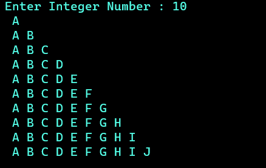
<pre> 


</pre>
<!-- 2nd pattern -->

#  2. Alphabetic Right Side Pattern (Same)

```c++

#include <iostream>
#include <conio.h>
using namespace std;
int main()
{
    int row, col, n;
    cout<< "Enter Integer Number : ";
    cin>> n;

    for(row = 1; row <= n; row++){

        for(col = 1; col <= row; col++){

            cout<< " " << char(row+64) ;/// char(row+96) it's return small letter

        };
        cout<<endl;
    };


    getch();
}

```
## <b>Input : 10</b>
___
## <b> Output - </b>
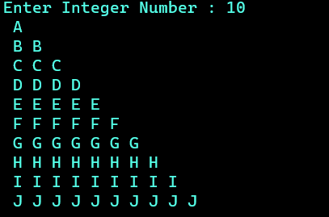
<pre> 


</pre>
<!-- 3rd pattern -->

# 3. Binary Right Side Pattern 


```c++
#include <iostream>
#include <conio.h>
using namespace std;
int main()
{
    int row, col, n;

    cout<< "Enter Integer Number : ";
    cin>> n;

    for(row = 1; row <= n; row++){

        for(col = 1; col <= row; col++){

            cout<< " " << (col%2) ;

        };
        cout<<endl;
    };


    getch();
}


```

## <b>Input : 10</b>
___

## <b> Output - </b>

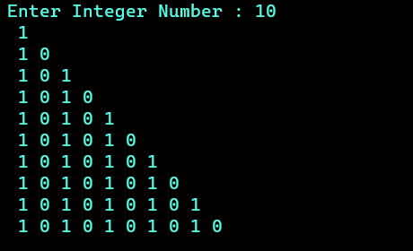


<pre> 


</pre>


<!-- 4th pattern -->

# 4. Binary Right Side Pattern (Same)

```c++

#include <iostream>
#include <conio.h>
using namespace std;
int main()
{
    int row, col, n;

    cout<< "Enter Integer Number : ";
    cin>> n;

    for(row = 1; row <= n; row++){

        for(col = 1; col <= row; col++){

            cout<< " " << (row%2) ;

        };
        cout<<endl;
    };


    getch();
}

```

## <b>Input : 10</b>
___

## <b> Output - </b>

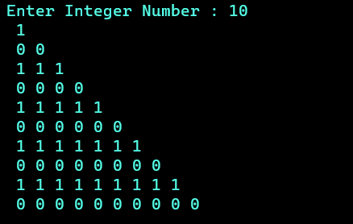


<pre> 


</pre>


<!-- 9th pattern -->

# 5. Pyramid Right Pattern 

```c++

#include<iostream>
#include<conio.h>
using namespace std;
int main()
{
    while (true)
    {
    
    int row, col, n;
    cout<<  "Enter N : ";
    cin>> n;
    for (row = 1; row <= n; row++){

        for(col = 1; col <= row; col++)
        {
            cout<< "* ";
        }
        cout << endl;
    }

    for (row = n-1; row >= 1; row--)
    {

        for (col = 1; col <= row; col++)
        {
            cout<< "* ";
        }
        cout<< endl;
    }

    }
    return 0;
    getch();
}

```

## <b>Input : 10</b>
___

## <b> Output - </b>

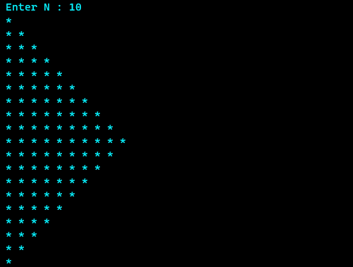


<pre> 


</pre>


<!-- 5th pattern -->

# 6. Double Triangle Pattern  


```c++

#include <iostream>
#include <conio.h>
using namespace std;
int main()
{
    int col, row, n;
    cout<<"Enter Number : ";
    cin>> n;
    /*
    1
    1 2
    1 2 3
    */

    for (row = 1; row <= n; row++){
        for (col = 1; col <= row; col++){
            cout<< " "<<col;
        }
        cout<<endl;
    }
    /*
    1 2 3
    1 2
    1
    */

    for (row = (n-1); row >= 1; row--){
        for (col = 1; col <= row; col++){
            cout<<" "<<col;
        }
        cout<<endl;
    }

    getch();
}


```

## <b>Input : 10</b>
___

## <b> Output - </b>

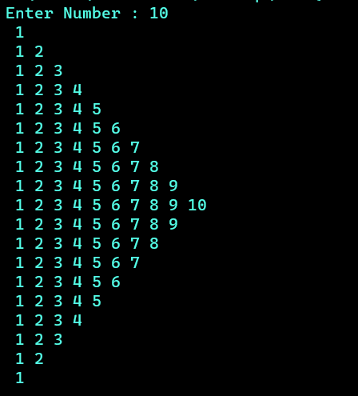


<pre> 


</pre>


<!-- 6th pattern -->

# 7. Pyramid Pattern 

```c++

#include<iostream>
#include<conio.h>
using namespace std;
int main()
{
    while(true){


    int n, col, row;
    cout<< "Enter N : ";
    cin>> n;
    for (row = 1; row <= n; row++)
    {

        //Printing spaces
        for (col = 1; col <= n-row; col++)
        {

            cout<< "  ";

        };
        //Printing star
        for (col =1; col <= 2*row-1; col++){

            cout<< "* ";
        };
        cout<< endl;
    }

}//End while loop
    getch();
}

```

## <b>Input : 10</b>
___

## <b> Output - </b>

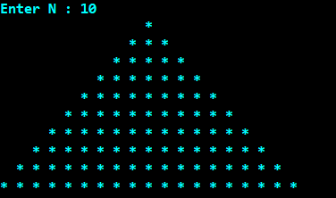


<pre> 


</pre>


<!-- 7th pattern -->

# 8. Double Pyramid Pattern 

```c++

#include<iostream>
#include<conio.h>
using namespace std;
int main()
{
    while(true){


    int n, col, row;
    cout<< "Enter N : ";
    cin>> n;
    for (row = 1; row <= n; row++)
    {

        //Printing spaces
        for (col = 1; col <= n-row; col++)
        {

            cout<< "  ";

        };
        //Printing star
        for (col =1; col <= 2*row-1; col++){

            cout<< "* ";
        };
        cout<< endl;
    }

    ///Reverse Pyramid
        for (row = n-1; row >= 1; row--)
        {

        //Printing spaces
        for (col = 1; col <= n-row; col++)
        {

            cout<< "  ";

        };
        //Printing star
        for (col =1; col <= 2*row-1; col++){

            cout<< "* ";
        };
        cout<< endl;
    };

}//End while loop
    getch();
}


```

## <b>Input : 10</b>
___

## <b> Output - </b>

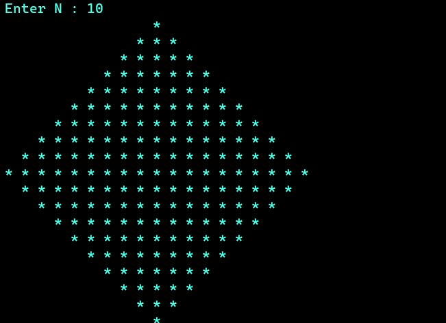


<pre> 


</pre>


<!-- 8th pattern -->

# 9. Upside Down Triangle Pattern 

```c++

#include <iostream>
#include <conio.h>
using namespace std;
int main()
{
    int row, col, n;
    cout<< "Enter Integer Number : ";
    cin>> n;

    for(row = n; row >= 1; row--){

        for(col = 1; col <= row; col++){

            cout<< " " << row;
        };
        cout<<endl;
    };


    getch();
}


```

## <b>Input : 9</b>
___

## <b> Output - </b>

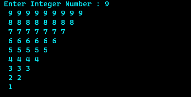


<pre> 


</pre>


<!-- 10th pattern -->

# 10. Rectriangle Pattern 

```c++

#include<iostream>
#include<conio.h>
using namespace std;
int main()
{
while(1){
    int n, col, row;
    cout<<"Enter Number : ";
    cin>>n;
    for (row = 1; row <= n; row++)
    {

        ///spacing
        for (col = 1; col <= n-row; col++)
        {
            cout<< " ";
        }
        ///number
        for (col = 1; col <= row; col++)
        {
            cout<<char(col+64) ;//col
        }
        cout<< endl;
    }
}

    getch();
}

```

## <b>Input : 10</b>
___

## <b> Output - </b>

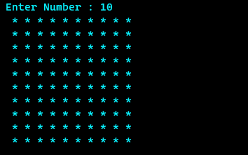


<!-- 11th pattern -->

# 10. Rectriangle Pattern 

```c++

#include <iostream>
#include <conio.h>
using namespace std;
int main()
{
    int rows,columns,i,j;
    cout<<"Enter the number of rows : ";
    cin>>rows;
    cout<<"Enter the number of columns : ";
    cin>>columns;
    for (i=1; i<=rows; i++){
    for (j=1; j<=columns; j++){
    if(i==1||i==rows||j==1||j==columns){
        cout<<"*";
    }else{
        cout<<" ";
    }
}
    cout<<endl;
}
    return 0;
}


```

## <b>Input : 10 & 20</b>
___

## <b> Output - </b>

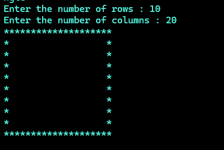


